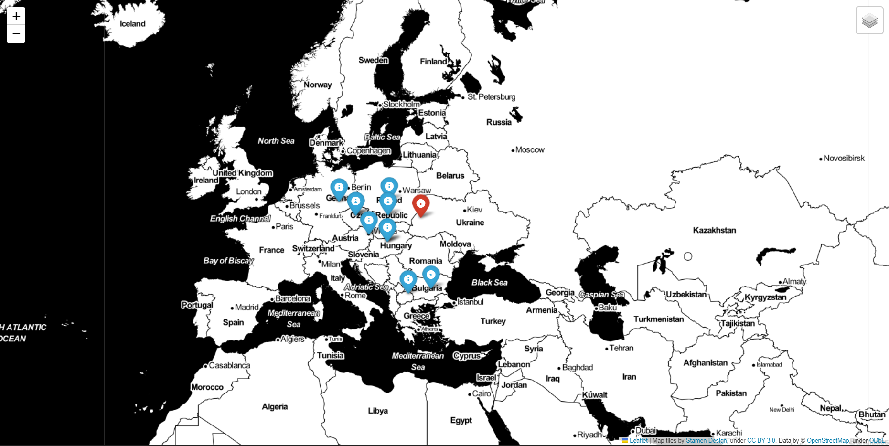

# Locations of films

This module created for visualizing what films was filmed nearest to location you write in year you write.

## Usage/Examples

You can run the code from terminal. You need to write the year of films, longitude, latitude and the name of file with films.

```python
python map.py 2015 49.83826 24.02324 locations.list
```


## Screenshots



